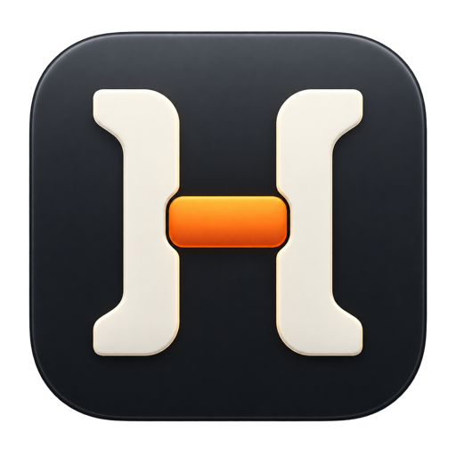

<p align="center">
  
</p>

<h1 align="center">Harness Manager</h1>

<p align="center">
  Your AI stack, under control. Discover, install, update, and understand the tools you use to build with AI — in one native Mac app.
</p>

<p align="center">
  <a href="https://github.com/juansebsol/mac-ai-harness-manager/releases/latest/download/Harness-Manager.dmg">Download for Mac</a> ·
  <a href="https://github.com/juansebsol/mac-ai-harness-manager/releases">Releases</a>
</p>

---

Harness Manager sits above your AI coding tools and keeps the whole stack easy to see. Find harnesses, MCP servers, and skills; check what is installed; launch the tools you use; and keep up with changes in the ecosystem.

It is free, open source, and built natively for macOS.

- **Discover** — browse coding harnesses, meta-harnesses, MCPs, and skills, ordered by popularity.
- **Manage** — see what is installed, what needs an update, and what is available for your Mac.
- **Understand** — inspect providers, package managers, running processes, and local configuration signals.
- **Stay current** — follow harness news, official releases, and community discoveries in one briefing.
- **Compare** — explore live model rankings and pricing from Modelgrep.

## Download

Download the latest DMG from [Releases](https://github.com/juansebsol/mac-ai-harness-manager/releases/latest), open it, and drag Harness Manager to Applications.

Requires macOS 14 or later. The release supports both Apple silicon and Intel Macs.

The current preview is ad-hoc signed and not Apple-notarized, so macOS may ask you to approve it in **System Settings → Privacy & Security** on first launch.

## Build from source

You need Xcode 15 or newer to build the Mac app.

```bash
make run       # build and open the native app
make build     # compile the Release app
make test      # run isolated workflow tests
make dmg       # create the downloadable DMG and checksums
```

The packaged app is written to `apps/mac/build/Harness Manager.app`. The release files are written to `apps/mac/dist/`.

To work on the website:

```bash
cd apps/web
npm ci
npm run dev
```

## How it works

Harness Manager discovers tools and configuration locally. It does not upload provider credentials or turn your Mac into a remote control panel. Installation and update commands are shown before they run and require confirmation.

Catalog entries and news link back to their original sources. Model rankings come from Modelgrep and are cached locally for a smoother experience. The app can work with package managers such as npm, pnpm, Bun, and Homebrew when they are available.

## Repository layout

```text
apps/mac/   Native SwiftUI app and release scripts
apps/web/   Next.js product site and landing page
content/    Product Hunt media and capture workflows
Docs/       Design, architecture, distribution, and validation notes
```

More detail is available in the [Mac app guide](apps/mac/README.md), [website guide](apps/web/README.md), and [distribution notes](Docs/DISTRIBUTION.md).

## Contributing

Harness Manager is early and improving quickly. If a tool is missing, a logo is wrong, or an install flow needs work, open an issue or send a pull request with the details.

## License

[Apache License 2.0](LICENSE) — free to use, modify, and distribute, including commercially.

Copyright 2026 Juan Sebastian Solano.
